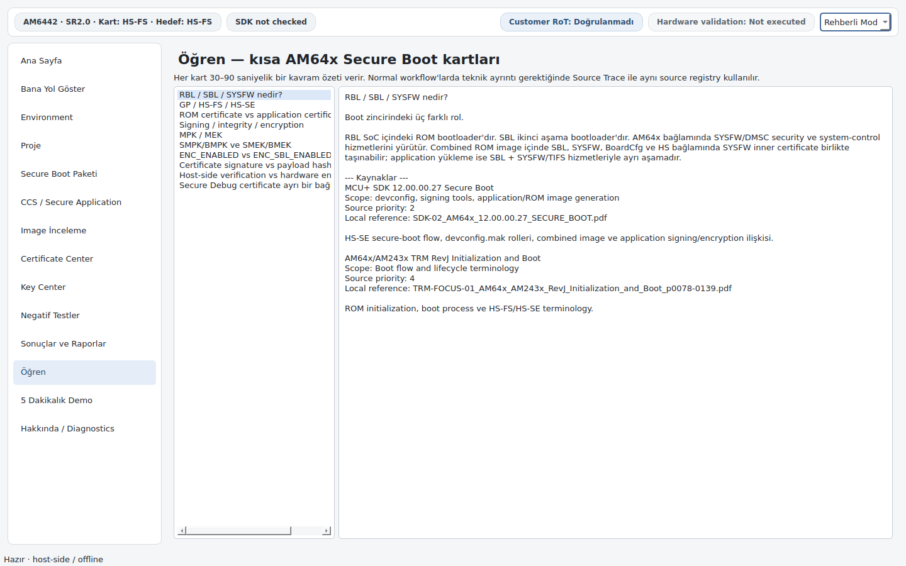
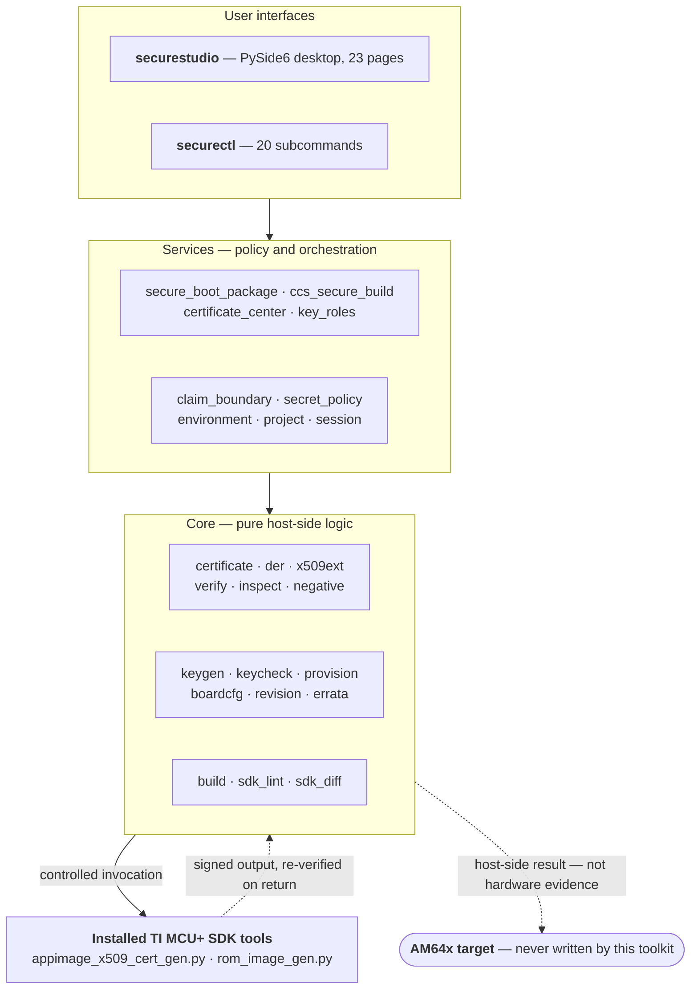

<div align="center">

# AM64x Secure Boot Studio

**A guided desktop application and CLI for preparing, inspecting and verifying
secure boot artifacts on Texas Instruments AM64x / AM6442 devices.**

[](https://github.com/celilaslan/am64x-secure-boot-studio/actions/workflows/ci.yml)
[](https://www.python.org/)
[](#testing-and-quality)
[](https://docs.astral.sh/ruff/)
[](LICENSE)

[Türkçe README](README.tr.md) · [Kullanım kılavuzu (TR)](docs/KULLANIM.md) · [Architecture](docs/ARCHITECTURE.md) · [Security boundary](docs/SECURITY_BOUNDARY.md)


</div>

---

## The problem

Bringing up secure boot on an AM64x device is not one operation — it is a chain of
them. You generate an RSA signing key, build an application, create an X.509
certificate carrying TI-specific extensions, bind that certificate to the exact
payload hash, match the device lifecycle (HS-FS or HS-SE) to the output family,
and load the result over UART or OSPI. Each link has its own TI tool, its own
required fields, and its own way of failing quietly.

The usual failure mode is not a crash. It is a board that simply does not boot,
with no indication of which link broke — a certificate built against a stale
payload, a signing key that does not match the provisioned Root of Trust, or an
HS-SE image written to an HS-FS part.

## What this project does

Secure Boot Studio puts a verification layer around that chain. It does **not**
replace TI's official signing tools: it calls the installed
`appimage_x509_cert_gen.py` and `rom_image_gen.py` from the MCU+ SDK, and checks
the inputs before the call and the outputs after it.

Concretely, it:

- **Refuses to produce a mismatched package.** The physical board lifecycle and the
  build target are tracked as separate facts. A package built for a lifecycle that
  does not match the board cannot be written to it.
- **Verifies signing identity on both sides of the build.** Before invoking CCS, the
  certificate and private key are compared by DER-SPKI public-key identity.
  Afterwards, the public-key fingerprint embedded in TI's generated certificate is
  compared against the certificate you selected — a mismatch fails the package.
- **Explains rather than dumps.** Every check result carries a human-readable
  verdict, a "why?" panel and a reference to the TI source that defines the rule,
  instead of raw JSON.
- **Keeps secrets out of its own output.** Private key paths, MEK values and key
  hashes are never written to preferences, reports, project metadata or the
  artifact index. This is enforced by tests, not just convention.

Everything runs **host-side and offline**: no telemetry, no auto-update, no SDK
download.

## Security boundary

This is the most important section in this README, and it is deliberately placed
before the feature list.

A successful host-side result from this toolkit means the *host-side* check
passed. It is **not** evidence that the target device enforces anything.

The toolkit **does not**:

- program OTP / eFuses,
- perform the HS-FS → HS-SE lifecycle transition,
- provision a customer Root of Trust,
- apply any permanent debug or security change on a target,
- or prove that secure boot is enforced on silicon.

A clean `verify` and an exit code of `0` from CCS or UniFlash are not proof of
secure boot. The only proof is the device booting the signed image with the
expected UART output on a provisioned part. The toolkit states this in the GUI,
in reports and in every result that could otherwise be mistaken for hardware
evidence.

Full details: [`docs/SECURITY_BOUNDARY.md`](docs/SECURITY_BOUNDARY.md). To report a
security issue, see [`SECURITY.md`](SECURITY.md).

## Screenshots

> The interface language is Turkish. These images are rendered directly from the
> application by [`tools/capture_screenshots.py`](tools/capture_screenshots.py),
> which CI also runs headlessly across all 23 pages to catch render regressions.

| Secure Boot Package — lifecycle gate | Certificate Center |
| --- | --- |
|  |  |
| Board state and build target are chosen **separately**, so a lifecycle mismatch is caught before anything reaches the board. | Create, inspect, verify, export, reissue and compare X.509 certificates, with a public-only certificate library. |

| Key Center | Guided learning |
| --- | --- |
|  |  |
| Application and provisioning key roles are kept visually distinct; key metadata is shown without revealing secret material. | Built-in explanations, source tracing and a synthetic five-minute demo marked explicitly as non-production. |

## Quick start

Python 3.10 or newer is required.

```bash
git clone https://github.com/celilaslan/am64x-secure-boot-studio.git
cd am64x-secure-boot-studio
python3 -m venv .venv && . .venv/bin/activate
pip install -e ".[gui]"
securestudio
```

CLI only (no PySide6 needed):

```bash
pip install -e .
securectl --help
```

### Launchers

On a source checkout you can skip virtual-environment handling entirely:

```powershell
.\studio.cmd          # Windows — creates .venv and GUI dependencies on first run
```

```bash
bash studio.sh        # Linux — no sudo, no Git, no manual activation required
```

`studio.sh` installs into the user's XDG cache directory rather than the project
folder, so a Git-less update works by downloading the repository ZIP, extracting
it and running the same launcher from the new directory.

### Common commands

```bash
securectl inspect <IMAGE_OR_CERTIFICATE>      # read structure, change nothing
securectl verify  <IMAGE_OR_CERTIFICATE>      # host-side signature + integrity
securectl report image <IMAGE> --output report.md

securectl cert new app --output app.yaml      # create a certificate profile
securectl cert validate app.yaml

securectl key generate set --profile development --output-dir <EMPTY_DIR>
securectl environment --sdk-root <SDK_ROOT>   # check SDK / tooling state
securectl errata --help                       # filter silicon errata by context
```

Building a signed application image through TI's official signer:

```bash
securectl build app \
  --tool <SDK>/source/security/security_common/tools/boot/signing/appimage_x509_cert_gen.py \
  --input <APP_MCELF> \
  --key <PRIVATE_SIGNING_KEY_PATH> \
  --output <OUTPUT_APPIMAGE> \
  --post-verify
```

## Feature overview

<table>
<tr><td width="50%" valign="top">

**Build and packaging**
- One-screen secure boot package flow: lifecycle gate, CCS application, optional SBL / combined boot image, key selection, UART/OSPI load plan
- Controlled invocation of the installed TI application and ROM signers
- Automatic CCS post-build recipe execution
- MCU+ SDK auto-discovery with remembered SDK root

**Certificates**
- Certificate Center: create Application and Secure Debug certificates from scratch, including full Subject entry
- Inspect, verify, export (DER/PEM/SPKI), reissue and compare
- Certificate ↔ private key matching by DER-SPKI identity
- Public-only project certificate library
- Context routing that refuses to reuse one certificate template across ROM / Application / Generic Data / Secure Debug / Keywriter flows

</td><td width="50%" valign="top">

**Verification and analysis**
- Independent host-side signature and payload/ciphertext integrity checks
- Controlled negative-test copies (signature, TBSCertificate, payload, ciphertext, ROM component mutation)
- RSA signing key and AES-256 MEK format checks
- Synthetic, explicitly non-production RSA-4096 / AES-256 key generation
- Markdown and JSON verification reports

**Configuration and policy**
- HS-FS → HS-SE offline provisioning readiness checks
- KEYREV / SWREV evaluation without writing to the target
- Security Board Configuration policy checks
- `devconfig.mak` / Makefile / signing-tool security lint and SDK-to-SDK diff
- AM64x boot and security errata filtering by silicon revision and usage context
- Generic binary authentication and optional encryption packaging

</td></tr>
</table>

The desktop application separates a **Guided Mode** for everyday tasks from an
**Expert Mode** that exposes the advanced offline and security screens.

## Architecture



`claim_boundary` and `secret_policy` are the two modules that make the guarantees
in this README enforceable: the first stops an offline result from being reported
as hardware evidence, the second stops secret material from reaching any
persisted output.

See [`docs/ARCHITECTURE.md`](docs/ARCHITECTURE.md) for the module-level breakdown.

## Testing and quality

| | |
| --- | --- |
| Tests | **288**, across 56 files (~4,800 lines) |
| Source | 92 modules, ~18,900 lines |
| Lint | `ruff check` clean, enforced in CI |
| CI matrix | Python 3.10 – 3.13 on Ubuntu and Windows |
| GUI verification | all 23 pages rendered headlessly on every push |

```bash
pip install -e ".[dev]"
pytest -q
```

The suite is not limited to unit tests. It also locks behaviour that is easy to
regress silently:

- **Secret-safety contracts** — assertions that key paths, MEK values and secret
  filenames never appear in manifests, preferences, reports or the project
  artifact index.
- **Claim-boundary contracts** — assertions that offline results are never labelled
  as hardware or enforcement evidence.
- **UI contracts** — GUI option values are locked against the backend's canonical
  enumerations, so a dropdown cannot drift away from the logic behind it.
- **Real-output regressions** — parsing is tested against the byte layouts produced
  by real MCU+ SDK builds, including TI's 4-byte default `destAddr` encoding.

Offscreen Qt rendering proves the interface constructs and paints without runtime
errors. It does not replace human visual QA on a real desktop, and the project
does not claim otherwise.

## Documentation

| Document | Contents |
| --- | --- |
| [`docs/KULLANIM.md`](docs/KULLANIM.md) | Full command reference (Turkish) |
| [`docs/ARCHITECTURE.md`](docs/ARCHITECTURE.md) | Modules and data flow |
| [`docs/SECURITY_BOUNDARY.md`](docs/SECURITY_BOUNDARY.md) | What the toolkit does and does not claim |
| [`SECURITY.md`](SECURITY.md) | Reporting a vulnerability, and what is in scope |
| [`docs/CERTIFICATES.md`](docs/CERTIFICATES.md) · [`docs/CERTIFICATE_CENTER.md`](docs/CERTIFICATE_CENTER.md) | X.509 operations and the Certificate Center |
| [`docs/KEYS.md`](docs/KEYS.md) | Signing key and MEK handling |
| [`docs/PROVISIONING.md`](docs/PROVISIONING.md) · [`docs/REVISION.md`](docs/REVISION.md) · [`docs/BOARDCFG.md`](docs/BOARDCFG.md) | Provisioning readiness, KEYREV/SWREV, board configuration |
| [`docs/SDK_LINT.md`](docs/SDK_LINT.md) · [`docs/SDK_DIFF.md`](docs/SDK_DIFF.md) | SDK source and configuration checks |
| [`docs/ERRATA.md`](docs/ERRATA.md) · [`docs/GENERIC_DATA.md`](docs/GENERIC_DATA.md) · [`docs/NEGATIVE_TESTS.md`](docs/NEGATIVE_TESTS.md) | Errata filtering, generic data packaging, negative tests |
| [`docs/GUI.md`](docs/GUI.md) · [`docs/GUI_UX_BLUEPRINT_v2.0.md`](docs/GUI_UX_BLUEPRINT_v2.0.md) | Desktop interface and its UX blueprint |
| [`docs/SOURCES.md`](docs/SOURCES.md) | Mapping from TI source documents to modules |
| [`CHANGELOG.md`](CHANGELOG.md) | Version history |
| [`docs/archive/`](docs/archive/) | Historical per-iteration development and QA records |

## Technical sources

The AM64x and TISCI rules implemented here are derived from version-specific
official TI documentation and from the installed MCU+ SDK sources reviewed during
development:

- MCU+ SDK `12.00.00.27`
- SYSFW / TISCI `12.00.02`
- AM64x/AM243x Technical Reference Manual, Rev. J
- AM64x/AM243x Silicon Errata, Rev. J

[`docs/SOURCES.md`](docs/SOURCES.md) records which source backs which module. The
toolkit does not invent target addresses, IDs or offsets that are absent from
these sources.

Enterprise PKI features such as CSR workflows, CA hierarchies, CRL and OCSP are
intentionally absent: they are not part of the self-signed TI secure-image and
debug-certificate flow defined by the version-locked AM64x sources, and the
project does not bend the vendor flow to accommodate them.

## Project status

Current development release: **`2.0.0-alpha33`**.

Host-side functionality is implemented and covered by the test suite, which CI
runs on Python 3.10-3.13 across Ubuntu and Windows.

That establishes that the logic runs on both platforms. It is deliberately not the
same claim as validating the desktop application on a clean Windows machine, or the
boot flow on real silicon — both of which are still in progress. No final release is
declared, and the project's own `beta-readiness` check reports `PARTIAL` until
clean-machine and hardware validation are executed.

## License

[MIT](LICENSE) © Celil Aslan

This project is an independent work. It is not affiliated with, endorsed by, or
supported by Texas Instruments. AM64x, AM243x, AM6442, Code Composer Studio and
MCU+ SDK are trademarks of Texas Instruments Incorporated.
