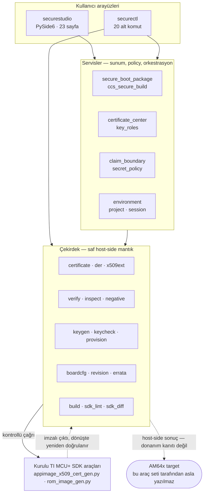

<div align="center">

# AM64x Secure Boot Studio

**Texas Instruments AM64x / AM6442 cihazlarında secure boot artifact'larını
hazırlamak, incelemek ve doğrulamak için rehberli masaüstü uygulaması ve CLI.**

[](https://github.com/celilaslan/am64x-secure-boot-studio/actions/workflows/ci.yml)
[](https://www.python.org/)
[](#test-ve-kalite)
[](https://docs.astral.sh/ruff/)
[](LICENSE)

[English README](README.md) · [Kullanım kılavuzu](docs/KULLANIM.md) · [Mimari](docs/ARCHITECTURE.md) · [Güvenlik sınırı](docs/SECURITY_BOUNDARY.md)


</div>

---

## Problem

AM64x üzerinde secure boot'u ayağa kaldırmak tek bir işlem değil, bir zincirdir.
RSA signing key üretirsiniz, application'ı build edersiniz, TI'a özgü extension
alanlarını taşıyan bir X.509 certificate oluşturursunuz, bu certificate'ı tam
olarak o payload'ın hash'ine bağlarsınız, cihaz lifecycle'ını (HS-FS veya HS-SE)
çıktı ailesiyle eşleştirirsiniz ve sonucu UART ya da OSPI üzerinden yüklersiniz.
Zincirin her halkasının kendi TI aracı, kendi zorunlu alanları ve kendine özgü
sessizce başarısız olma biçimi vardır.

Alışıldık hata biçimi bir çökme değildir. Hangi halkanın koptuğuna dair hiçbir
işaret vermeden **boot etmeyen bir karttır**: eski bir payload'a göre üretilmiş
certificate, provision edilmiş Root of Trust ile eşleşmeyen bir signing key veya
HS-FS bir parçaya yazılmış HS-SE image.

## Bu proje ne yapar

Secure Boot Studio bu zincirin çevresine bir doğrulama katmanı koyar. TI'ın resmî
imzalama araçlarının **yerine geçmez**: MCU+ SDK içindeki kurulu
`appimage_x509_cert_gen.py` ve `rom_image_gen.py` araçlarını çağırır, çağrıdan
önce girdileri ve çağrıdan sonra çıktıları kontrol eder.

Somut olarak:

- **Eşleşmeyen paket üretmeyi reddeder.** Fiziksel kart lifecycle'ı ile build hedefi
  ayrı bilgiler olarak tutulur. Kartın durumuyla eşleşmeyen bir hedefe göre
  üretilmiş paket karta yazılamaz.
- **Signing kimliğini build'in iki tarafında da doğrular.** CCS çağrılmadan önce
  certificate ile private key DER-SPKI public-key kimliği üzerinden karşılaştırılır.
  Çağrıdan sonra ise TI'ın ürettiği certificate'a gömülü public-key parmak izi,
  seçtiğiniz certificate ile tekrar karşılaştırılır; eşleşme yoksa paket başarısız
  sayılır.
- **Dökmek yerine açıklar.** Her kontrol sonucu ham JSON yerine insan-okunur bir
  değerlendirme, bir "Neden?" paneli ve kuralı tanımlayan TI kaynağına referans
  taşır.
- **Secret'ları kendi çıktısının dışında tutar.** Private key yolları, MEK değerleri
  ve key hash'leri; tercihlere, raporlara, proje metadata'sına veya artifact
  index'ine yazılmaz. Bu yalnız bir teamül değil, testlerle zorlanan bir kuraldır.

Her şey **host tarafında ve çevrimdışı** çalışır: telemetri, otomatik güncelleme
veya SDK indirme yoktur.

## Güvenlik sınırı

Bu README'nin en önemli bölümüdür ve özellikle özellik listesinden **önce**
konumlandırılmıştır.

Bu araç setinden alınan başarılı bir host-side sonuç, yalnızca *host tarafındaki*
kontrolün geçtiği anlamına gelir. Hedef cihazın herhangi bir şeyi enforce ettiğine
dair **kanıt değildir**.

Araç seti şunları **yapmaz**:

- OTP / eFuse programlamaz,
- HS-FS → HS-SE lifecycle geçişini gerçekleştirmez,
- customer Root of Trust provision etmez,
- target üzerinde kalıcı debug veya security değişikliği uygulamaz,
- silikon üzerinde secure boot'un enforce edildiğini kanıtlamaz.

Temiz bir `verify` sonucu ve CCS ya da UniFlash'ten dönen `0` çıkış kodu secure
boot kanıtı değildir. Tek kanıt, provision edilmiş bir parçada imzalı image'ın
beklenen UART çıktısıyla boot etmesidir. Araç seti bunu GUI'de, raporlarda ve
donanım kanıtı sanılabilecek her sonuçta açıkça belirtir.

Ayrıntılar: [`docs/SECURITY_BOUNDARY.md`](docs/SECURITY_BOUNDARY.md).

## Ekran görüntüleri

> Görüntüler doğrudan uygulamadan,
> [`tools/capture_screenshots.py`](tools/capture_screenshots.py) ile üretilir. CI
> aynı aracı 23 sayfanın tamamı için başsız (headless) çalıştırarak render
> regresyonlarını yakalar.

| Secure Boot Paketi — lifecycle kapısı | Certificate Center |
| --- | --- |
|  |  |
| Kart durumu ve üretim hedefi **ayrı ayrı** seçilir; böylece lifecycle uyuşmazlığı karta hiçbir şey ulaşmadan yakalanır. | X.509 certificate oluşturma, inceleme, doğrulama, export, yeniden üretme ve karşılaştırma; yalnız public certificate library. |

| Key Center | Rehberli öğrenme |
| --- | --- |
|  |  |
| Application ve provisioning key rolleri görsel olarak ayrılır; key metadata'sı secret içerik açığa çıkarılmadan gösterilir. | Yerleşik açıklamalar, source trace ve açıkça non-production olarak işaretlenmiş sentetik beş dakikalık demo. |

## Hızlı başlangıç

Python `3.10` veya üzeri gereklidir.

```bash
git clone https://github.com/celilaslan/am64x-secure-boot-studio.git
cd am64x-secure-boot-studio
python3 -m venv .venv && . .venv/bin/activate
pip install -e ".[gui]"
securestudio
```

Yalnız CLI (PySide6 gerekmez):

```bash
pip install -e .
securectl --help
```

### Başlatıcılar

Kaynak checkout'unda sanal ortamla hiç uğraşmadan çalıştırabilirsiniz:

```powershell
.\studio.cmd          # Windows — ilk çalıştırmada .venv ve GUI bağımlılıklarını hazırlar
```

```bash
bash studio.sh        # Linux — sudo, Git veya manuel aktivasyon gerekmez
```

`studio.sh` ortamı proje klasörüne değil kullanıcının XDG cache dizinine kurar.
Bu sayede Git kullanamıyorsanız güncelleme için depo ZIP'ini indirip çıkarmanız ve
yeni klasörde aynı başlatıcıyı çalıştırmanız yeterlidir.

### Sık kullanılan komutlar

```bash
securectl inspect <IMAGE_VEYA_CERTIFICATE>    # yapıyı oku, hiçbir şeyi değiştirme
securectl verify  <IMAGE_VEYA_CERTIFICATE>    # host-side signature + integrity
securectl report image <IMAGE> --output rapor.md

securectl cert new app --output app.yaml      # certificate profile oluştur
securectl cert validate app.yaml

securectl key generate set --profile development --output-dir <BOS_DIZIN>
securectl environment --sdk-root <SDK_ROOT>   # SDK / araç durumunu kontrol et
securectl errata --help                       # errata'yı bağlama göre filtrele
```

TI'ın resmî signer'ı ile imzalı application image üretimi:

```bash
securectl build app \
  --tool <SDK>/source/security/security_common/tools/boot/signing/appimage_x509_cert_gen.py \
  --input <APP_MCELF> \
  --key <PRIVATE_SIGNING_KEY_PATH> \
  --output <OUTPUT_APPIMAGE> \
  --post-verify
```

## Özellikler

<table>
<tr><td width="50%" valign="top">

**Build ve paketleme**
- Tek ekranlı secure boot paketi akışı: lifecycle kapısı, CCS application, opsiyonel SBL / combined boot image, key seçimi, UART/OSPI yükleme planı
- Kurulu TI application ve ROM signer'larının kontrollü çağrılması
- CCS post-build tarifinin otomatik çalıştırılması
- MCU+ SDK otomatik keşfi ve hatırlanan SDK root

**Certificate işlemleri**
- Certificate Center: Application ve Secure Debug certificate'larını Subject alanları dahil sıfırdan oluşturma
- İnceleme, doğrulama, export (DER/PEM/SPKI), yeniden üretme ve karşılaştırma
- DER-SPKI kimliği üzerinden certificate ↔ private key eşleşmesi
- Yalnız public içerik barındıran proje certificate library'si
- ROM / Application / Generic Data / Secure Debug / Keywriter akışlarında aynı certificate template'inin yeniden kullanılmasını engelleyen context yönlendirmesi

</td><td width="50%" valign="top">

**Doğrulama ve analiz**
- Bağımsız host-side signature ve payload/ciphertext integrity kontrolleri
- Kontrollü negatif test kopyaları (signature, TBSCertificate, payload, ciphertext, ROM component mutasyonu)
- RSA signing key ve AES-256 MEK format kontrolleri
- Sentetik, açıkça non-production RSA-4096 / AES-256 key üretimi
- Markdown ve JSON doğrulama raporları

**Yapılandırma ve policy**
- HS-FS → HS-SE offline provisioning hazırlık kontrolleri
- Target'a yazmadan KEYREV / SWREV değerlendirmesi
- Security Board Configuration policy kontrolleri
- `devconfig.mak` / Makefile / signing-tool security lint'i ve SDK-SDK diff'i
- AM64x boot ve security errata'sını silicon revision ve kullanım bağlamına göre filtreleme
- Generic binary authentication ve opsiyonel encryption paketleme

</td></tr>
</table>

Masaüstü uygulaması günlük işler için **Rehberli Mod** ile ileri seviye offline ve
security ekranlarını açan **Uzman Modu**'nu birbirinden ayırır.

## Mimari



Bu README'deki garantileri zorlanabilir kılan iki modül `claim_boundary` ve
`secret_policy`'dir: birincisi offline bir sonucun donanım kanıtı olarak
raporlanmasını engeller, ikincisi secret içeriğin kalıcı hiçbir çıktıya
ulaşmamasını sağlar.

Modül bazında ayrıntı için: [`docs/ARCHITECTURE.md`](docs/ARCHITECTURE.md).

## Test ve kalite

| | |
| --- | --- |
| Testler | **288**, 56 dosyada (~4.800 satır) |
| Kaynak | 92 modül, ~18.900 satır |
| Lint | `ruff check` temiz, CI'da zorunlu |
| CI matrisi | Ubuntu ve Windows üzerinde Python 3.10 – 3.13 |
| GUI doğrulaması | her push'ta 23 sayfanın tamamı başsız render edilir |

```bash
pip install -e ".[dev]"
pytest -q
```

Test seti yalnız birim testlerinden ibaret değildir. Sessizce bozulması kolay olan
davranışları da kilitler:

- **Secret-safety kontratları** — key yollarının, MEK değerlerinin ve secret dosya
  adlarının manifest'lerde, tercihlerde, raporlarda veya proje artifact index'inde
  asla görünmediğini doğrulayan assertion'lar.
- **Claim-boundary kontratları** — offline sonuçların hiçbir zaman donanım veya
  enforcement kanıtı olarak etiketlenmediğini doğrulayan assertion'lar.
- **UI kontratları** — GUI seçenek değerleri backend'in kanonik enum'larına
  kilitlenir; böylece bir dropdown arkasındaki mantıktan kopamaz.
- **Gerçek çıktı regresyonları** — parsing, gerçek MCU+ SDK build'lerinin ürettiği
  byte düzenlerine karşı test edilir; TI'ın 4 byte'lık varsayılan `destAddr`
  kodlaması buna dahildir.

Başsız Qt render'ı, arayüzün çalışma zamanı hatası olmadan kurulduğunu ve
çizildiğini kanıtlar. Gerçek bir masaüstündeki insan görsel QA'sının yerine
geçmez ve proje bunun aksini iddia etmez.

## Dokümantasyon

| Doküman | İçerik |
| --- | --- |
| [`docs/KULLANIM.md`](docs/KULLANIM.md) | Tüm komutların ayrıntılı kullanımı |
| [`docs/ARCHITECTURE.md`](docs/ARCHITECTURE.md) | Modüller ve veri akışları |
| [`docs/SECURITY_BOUNDARY.md`](docs/SECURITY_BOUNDARY.md) | Araç setinin iddia ettiği ve etmediği şeyler |
| [`docs/CERTIFICATES.md`](docs/CERTIFICATES.md) · [`docs/CERTIFICATE_CENTER.md`](docs/CERTIFICATE_CENTER.md) | X.509 işlemleri ve Certificate Center |
| [`docs/KEYS.md`](docs/KEYS.md) | Signing key ve MEK kontrolleri |
| [`docs/PROVISIONING.md`](docs/PROVISIONING.md) · [`docs/REVISION.md`](docs/REVISION.md) · [`docs/BOARDCFG.md`](docs/BOARDCFG.md) | Provisioning hazırlığı, KEYREV/SWREV, board configuration |
| [`docs/SDK_LINT.md`](docs/SDK_LINT.md) · [`docs/SDK_DIFF.md`](docs/SDK_DIFF.md) | SDK kaynak ve yapılandırma kontrolleri |
| [`docs/ERRATA.md`](docs/ERRATA.md) · [`docs/GENERIC_DATA.md`](docs/GENERIC_DATA.md) · [`docs/NEGATIVE_TESTS.md`](docs/NEGATIVE_TESTS.md) | Errata filtreleme, generic data paketleme, negatif testler |
| [`docs/GUI.md`](docs/GUI.md) · [`docs/GUI_UX_BLUEPRINT_v2.0.md`](docs/GUI_UX_BLUEPRINT_v2.0.md) | Masaüstü arayüzü ve UX blueprint'i |
| [`docs/SOURCES.md`](docs/SOURCES.md) | TI kaynak dokümanlarının modüllerle eşlemesi |
| [`CHANGELOG.md`](CHANGELOG.md) | Sürüm geçmişi |
| [`docs/archive/`](docs/archive/) | İterasyon bazlı geçmiş geliştirme ve QA kayıtları |

## Teknik kaynaklar

Burada uygulanan AM64x ve TISCI kuralları, sürüme özgü resmî TI dokümantasyonuna
ve geliştirme sırasında incelenen kurulu MCU+ SDK kaynaklarına dayandırılmıştır:

- MCU+ SDK `12.00.00.27`
- SYSFW / TISCI `12.00.02`
- AM64x/AM243x Technical Reference Manual, Rev. J
- AM64x/AM243x Silicon Errata, Rev. J

Hangi kaynağın hangi modülü desteklediği [`docs/SOURCES.md`](docs/SOURCES.md)
içinde kayıtlıdır. Araç seti, bu kaynaklarda bulunmayan target adreslerini, ID'leri
veya offset'leri uydurmaz.

CSR akışları, CA hiyerarşileri, CRL ve OCSP gibi kurumsal PKI özellikleri
bilinçli olarak yoktur: bunlar, sürüm kilitli AM64x kaynaklarında tanımlanan
self-signed TI secure-image ve debug-certificate akışının parçası değildir ve
proje vendor akışını bunlara uydurmaya çalışmaz.

## Proje durumu

Güncel geliştirme sürümü: **`2.0.0-alpha33`**.

Host tarafındaki işlevsellik tamamlanmış ve test seti ile kapsanmıştır. Gerçek
Windows ve kart üzerinde doğrulama sürdüğü için final sürüm ilan edilmemiştir.
Temiz makine ve donanım doğrulaması çalıştırılana kadar release readiness,
projenin kendi `beta-readiness` kontrolü tarafından `PARTIAL` olarak raporlanır.

## Lisans

[MIT](LICENSE) © Celil Aslan

Bu proje bağımsız bir çalışmadır. Texas Instruments ile bağlantılı değildir,
TI tarafından onaylanmamış veya desteklenmemektedir. AM64x, AM243x, AM6442,
Code Composer Studio ve MCU+ SDK, Texas Instruments Incorporated'ın ticari
markalarıdır.
