# AM64x Secure Boot Studio — masaüstü arayüzü

Studio, PySide6/Qt tabanlıdır ve CLI ile **aynı** Python backend servislerini kullanır.
GUI kabuk katmanı komut satırı metni üretip `securectl` subprocess'i çalıştırmaz;
ilgili backend/workflow fonksiyonlarını doğrudan çağırır. Bu nedenle bir işlemin
sonucu, aynı işlemin CLI'dan çalıştırılmasıyla birebir aynı mantığa dayanır.

## Çalıştırma

```bash
pip install -e ".[gui]"
securestudio
```

veya:

```bash
securectl gui
```

PySide6 kurulu değilse CLI çalışmaya devam eder; yalnız GUI launch açık bir hata verir.

## Rehberli Mod ve Uzman Modu

Arayüz iki moda ayrılır. Mod seçimi sağ üstten yapılır ve yalnız kullanıcının kendi
bilgisayarındaki local preferences dosyasında saklanır.

| | |
| --- | --- |
| **Rehberli Mod** | Günlük işler: Ana Sayfa, Bana Yol Göster, Environment, Proje, Secure Boot Paketi, CCS / Secure Application, Image İnceleme, Certificate Center, Key Center, Negatif Testler, Sonuçlar ve Raporlar, Öğren, Demo. |
| **Uzman Modu** | Yukarıdakilere ek olarak ileri seviye offline/security ekranları: ROM Image, SDK Inspector / Compare, Errata Advisor, Provisioning Hazırlığı, KEYREV / SWREV, Security BoardCfg, Secure Debug, Generic Data, Source Trace. |

Uzman ekranlarından birine açıkça yönelmek (örneğin Ana Sayfa'daki bir bağlantıyla)
kullanıcı niyeti sayılır ve mod otomatik olarak Uzman Modu'na geçer.

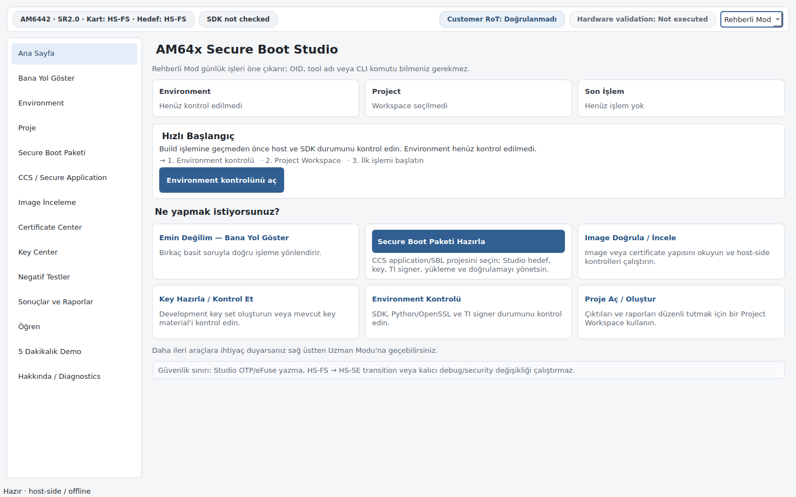

Ana Sayfa bir dashboard olarak çalışır: Environment / Project / Son İşlem durum
kartları, duruma göre güncellenen **Hızlı Başlangıç** önerisi (Environment → Project
→ ilk workflow) ve açıklamalı görev kartları.

## Ekranlar

### Secure Boot Paketi

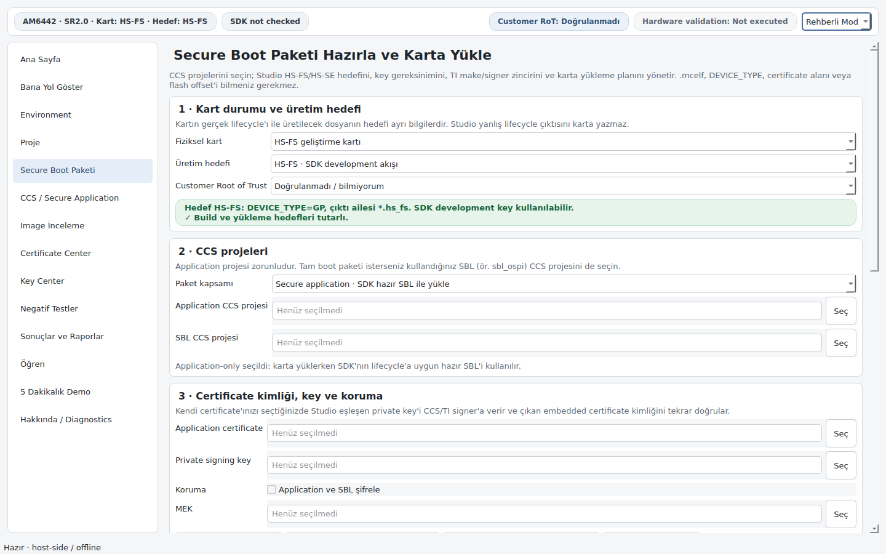

Tek ekranda: fiziksel kart durumu ve üretim hedefinin **ayrı** seçimi, CCS
application (ve istenirse SBL) projesi, certificate/key kimliği, opsiyonel
encryption ve karta yükleme planı. Kartın gerçek lifecycle'ı ile build hedefi ayrı
bilgiler olarak tutulur; eşleşmeyen paket karta yazılamaz.

### Certificate Center

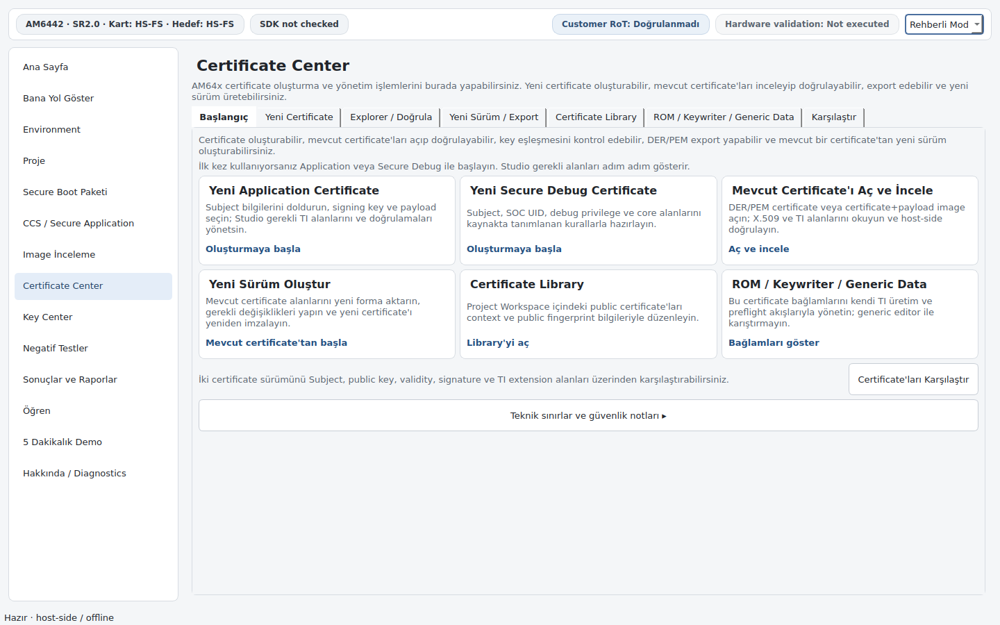

Public X.509 yaşam döngüsünün tamamı: Subject alanlarından başlayarak yeni
Application/Secure Debug certificate oluşturma, Explorer ile inceleme ve host-side
doğrulama, DER/PEM/SPKI export, mevcut certificate'tan yeni sürüm üretme, iki
certificate'ı karşılaştırma ve yalnız public kopya barındıran Certificate Library.

Ayrıntı: [`CERTIFICATE_CENTER.md`](CERTIFICATE_CENTER.md).

### Key Center

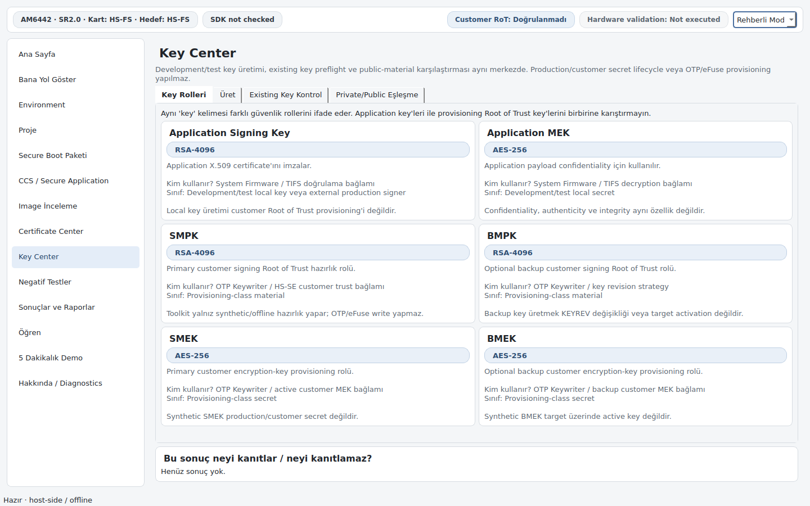

Application ve provisioning key rolleri görsel olarak ayrılır. Mevcut signing
key/MEK preflight kontrolü, private/public eşleşme kontrolü ve sentetik
(açıkça non-production) key set üretimi buradadır. Public identity metadata'sı
secret değer açığa çıkarılmadan gösterilir.

### Image İnceleme

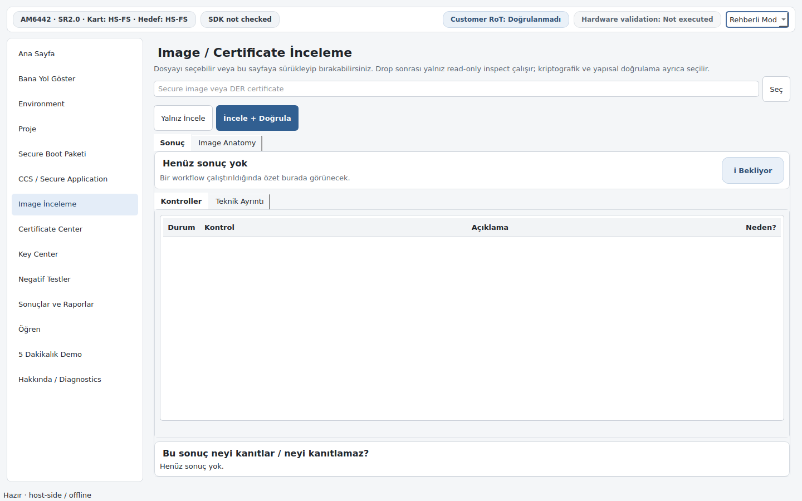

Read-only inceleme; sürükle-bırak ile dosya açılabilir.

### Bana Yol Göster

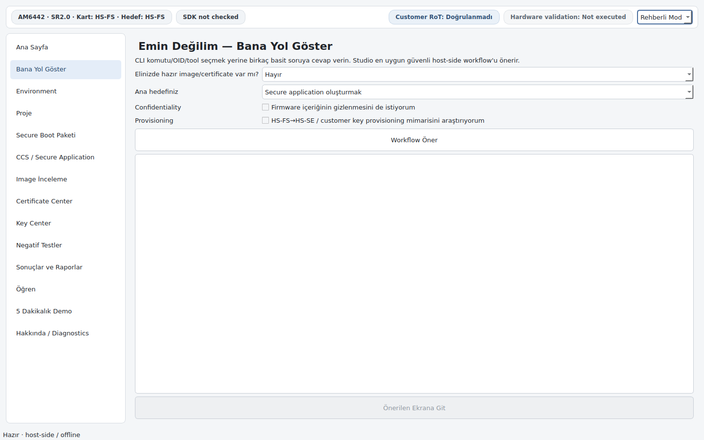

CLI komutu, OID veya tool adı bilmeden birkaç soruyla en uygun host-side workflow'a
yönlendirir.

### Environment ve Proje

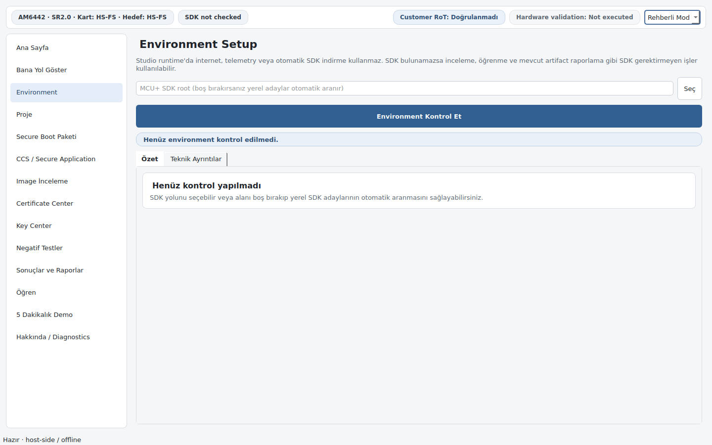

Environment ekranı MCU+ SDK, Python/OpenSSL ve TI signer durumunu kontrol eder.
Sonuçlar varsayılan olarak insan-okunur bir özet gösterir; tam path, hash ve ham
discovery JSON'ı **Teknik Ayrıntılar** altında kalır.

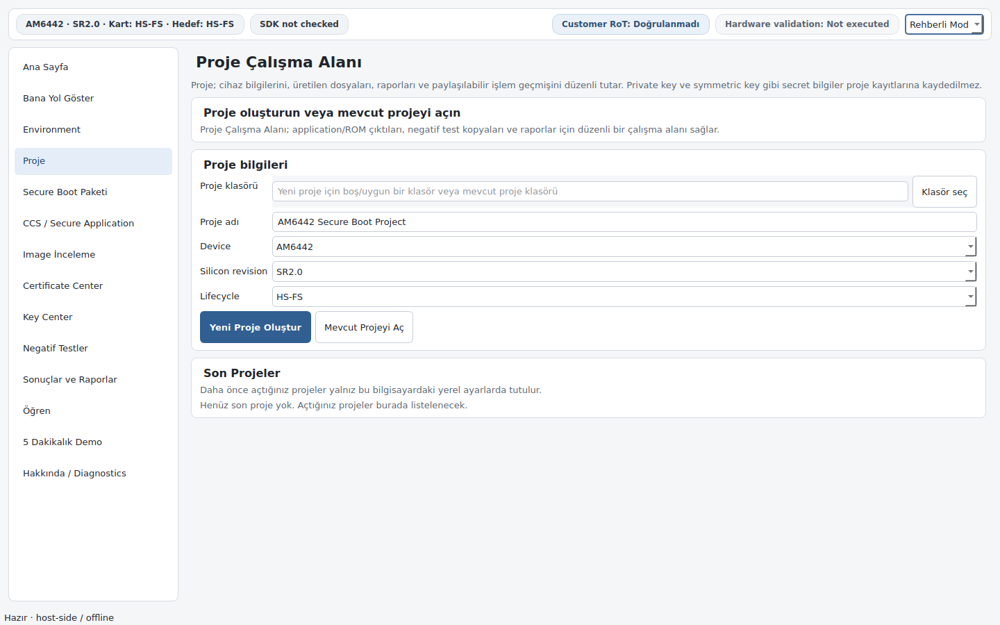

Proje ekranı, aktif proje yokken yalnız oluştur/aç akışını ve kompakt Son Projeler
listesini gösterir. Proje açıldığında Workspace Özeti, Üretilen Dosyalar ve
share-safe İşlem Geçmişi dashboard'u görünür.

### Sonuçlar ve Raporlar

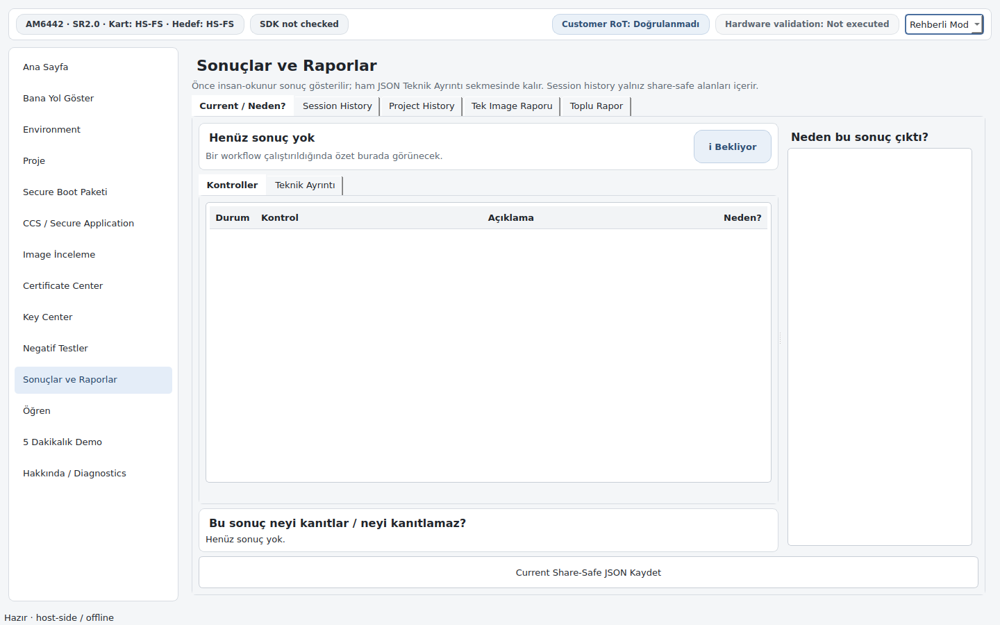

Güncel sonuç, bellek içi share-safe oturum geçmişi, tek image Markdown raporu ve
toplu rapor üretimi. Proje aktifse `Project History` sekmesi kalıcı, project-backed
geçmişi okur.

### İleri seviye ekranlar (Uzman Modu)

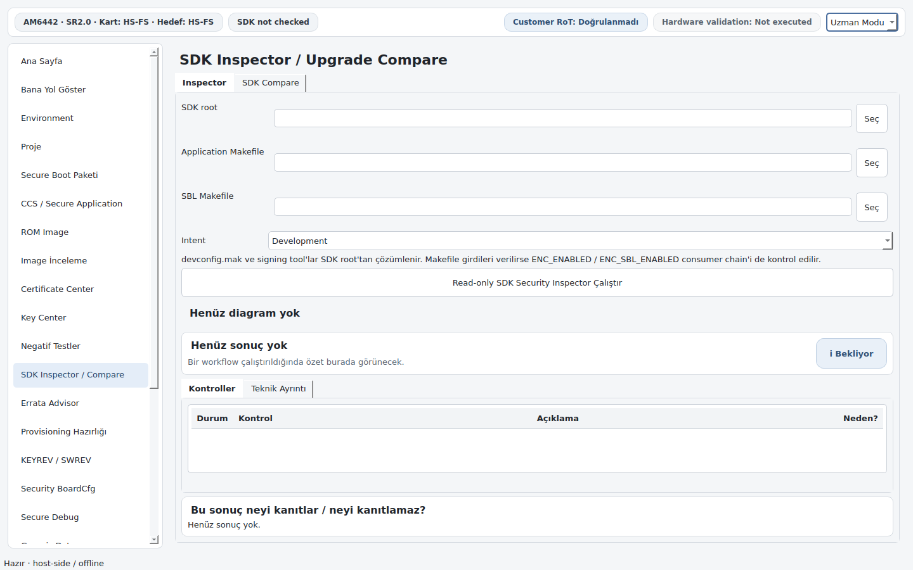

SDK Inspector `devconfig.mak`, Makefile ve signing tool consumer zincirlerini
read-only inceler; `ENC_ENABLED` ve `ENC_SBL_ENABLED` consumer chain'lerini ayrı
diagram lane'lerinde gösterir. SDK Compare iki SDK/source setini role bazlı
side-by-side semantic diff olarak karşılaştırır; configured key host path'leri
görünmez.

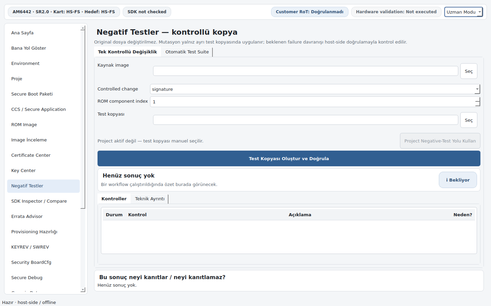

Negatif Testler tek mutasyon, otomatik suite ve ROM component mutasyonu sunar ve
yalnız ayrı dosya kopyaları üzerinde çalışır — kaynak image değiştirilmez.

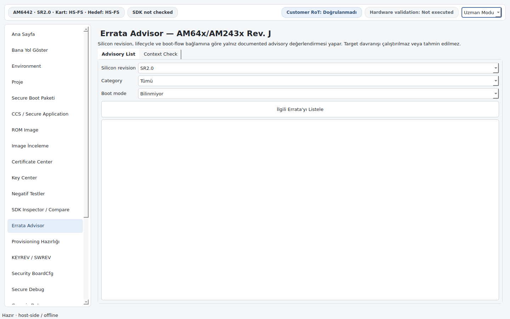

Errata Advisor, AM64x/AM243x Rev. J boot ve security advisory'lerini silicon
revision ile kullanım bağlamına göre filtreler.

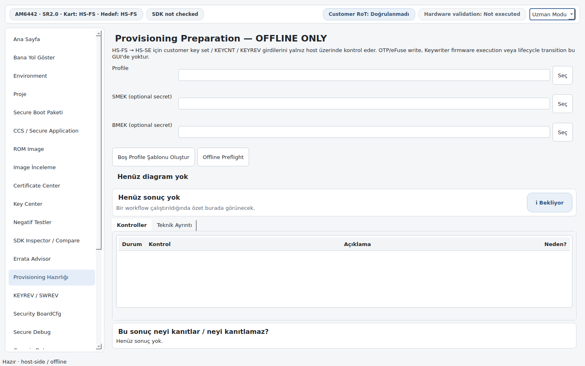

Provisioning Hazırlığı yalnız **offline** HS-FS → HS-SE hazırlık kontrolüdür.
Aynı görsel dili KEYREV / SWREV, Security BoardCfg, Secure Debug ve Generic Data
ekranları da kullanır.

## Ortak görsel/semantik sistem

Tüm workflow ekranları aynı iki bileşen üzerine kuruludur:

- **`FlowDiagramWidget`** — işlemin semantic akışını gösterir.
- **`HumanResultView`** — sonucu ham JSON yerine insan-okunur kontrol satırları
  olarak sunar. Her satırda source-aware bir **Neden?** açıklaması bulunur; bilinen
  kontroller kaynak-dayanaklı, bilinmeyen/gelecek kontroller ise temkinli ve
  status-aware bir açıklama gösterir. Ham teknik çıktı **Teknik Ayrıntılar** altında
  erişilebilir kalır.

Her sonuç panelinde **"Bu sonuç neyi kanıtlar / neyi kanıtlamaz?"** bölümü bulunur.
Bu, `services/claim_boundary.py` tarafından üretilir ve offline bir sonucun donanım
kanıtına yükseltilmesini engeller.

GUI etiketleri backend enum değerlerinden ayrıdır; canonical değerler
`services/ui_contract.py` içinde tutulur ve testlerle kilitlenir. Böylece bir
dropdown seçeneği arkasındaki mantıktan sessizce kopamaz.

## Proje farkındalıklı çıktı

Bir Project Workspace aktifken:

- Application ve ROM wizard'ları `outputs/`, Negatif Testler `negative-tests/`,
  Raporlar `reports/`, public-only DER export `public/` altında project-relative bir
  çıktı yolu **önerir**. Bu yalnız öneridir; kullanıcı değiştirebilir ve mevcut
  dosyalar overwrite edilmez.
- Her workflow sonucu compact ve share-safe bir `sessions/activity.jsonl` event'i
  olarak kaydedilir.
- Generated Artifact Index yalnız project-relative/basename-only çıktı referansı,
  boyut ve public artifact SHA-256'sı tutar.

Secret üreten key çıktısı Project Workspace içine **yazılamaz**. Böylece paylaşılabilir
workspace ile secret custody alanı birbirinden ayrılır.

Kalıcı event log; secret değer/path, full host path veya keyfi teknik JSON taşımaz.
Çıktı yolu yerine yalnız dosya adı tutulur.

## Hakkında / Diagnostics

`Hakkında / Diagnostics` sayfası environment ve beta-release durumunu share-safe
biçimde özetler. Export edilen JSON/Markdown içinde secret değer/hash/path,
kullanıcı adı, hostname veya full host path bulunmaz.

`PySide6 available` veya `PyInstaller available` satırları yalnız dependency
availability bilgisidir; gerçek Qt render veya clean-machine validation sonucu
değildir.

Proje ekranındaki **Son Projeler** listesi bundan farklıdır: yalnız kullanıcının
kendi bilgisayarındaki local preferences dosyasında kolaylık amacıyla tutulur ve
share-safe export kapsamına girmez.

## Güvenlik sınırı

GUI aşağıdaki target-changing işlemleri **sunmaz**:

- OTP / eFuse / customer-key programming
- HS-FS → HS-SE lifecycle transition
- kalıcı debug/security değişikliği
- Secure Debug / JTAG unlock gönderimi
- target tarafında `TISCI_MSG_PROC_AUTH_BOOT` çalıştırma

ROM load address, Host ID, OID veya tool option gibi source-sensitive değerler GUI
tarafından **tahmin edilmez**. Bu alanlar ya kullanıcı tarafından exact source/build
context'ten sağlanır ya da environment resolver tarafından yalnız gerçekten bulunan
tool path olarak çözülür.

Tam sınır tanımı: [`SECURITY_BOUNDARY.md`](SECURITY_BOUNDARY.md).

## Ekran görüntülerinin üretimi

Bu dosyadaki görüntüler uygulamadan doğrudan üretilir:

```bash
python tools/capture_screenshots.py --mode guided --pages home,secure_boot,certificate
python tools/capture_screenshots.py --mode expert --pages sdk,negative,errata,provisioning
```

Araç `AM64X_STUDIO_CONFIG_HOME` değişkenini geçici bir dizine yönlendirir; böylece her
çalıştırma varsayılan tercihlerle başlar ve kullanıcının gerçek ayarları okunmaz veya
değiştirilmez.

`tools/qt_visual_qa.py` aynı şekilde 23 sayfanın tamamını başsız render eder ve CI'da
her push'ta çalışır. Bu, render/runtime bozulmalarını yakalar; desteklenen bir
masaüstünde yapılacak **insan görsel QA'sının yerine geçmez**.
